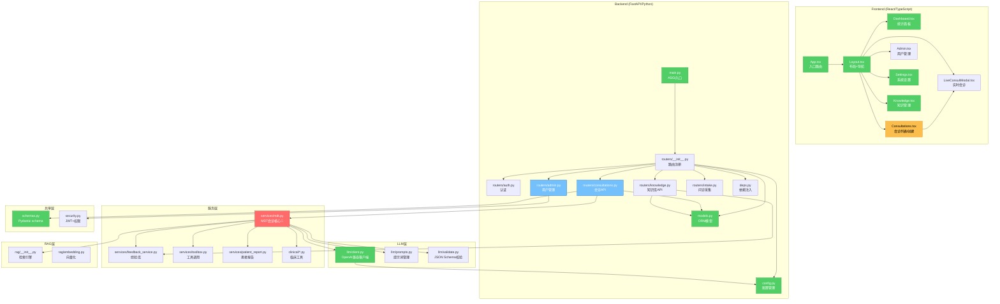

# Brooks-Lint Architecture Audit Report
**Project:** medconsult (汇诊 · 多学科 AI 会诊平台)  
**Date:** 2026-09-04  
**Auditor:** Agnes (LLM-powered architecture analysis)  
**Method:** Brooks-Lint decay risk analysis (R1-R6)

---

## Health Score

| Metric | Value |
|--------|-------|
| **Base Score** | 100 |
| Warnings (⚠️) | 5 × (-5) = -25 |
| Suggestions (💡) | 1 × (-1) = -1 |
| **Final Score** | **74** |

**Verdict:** ⚠️ **Attention needed** — multiple structural decay risks identified, none critical but several require refactoring to maintain long-term maintainability.

---

## Module Dependency Graph



---

## Findings

### 🔴 HIGH SEVERITY

---

#### F1: R1 Cognitive Overload — `_agnes_specialist_opinion` at 109 lines

**Location:** `backend/app/services/mdt.py` lines 278-387

**Symptom:** Function spans 109 lines with 5 abstraction levels mixed together: keyword detection → opinion data structure → lookup → text substitution → return. A reader must hold the entire opinion template for 8 specialties × 2 rounds in memory simultaneously.

**Source Code:**
```python
def _agnes_specialist_opinion(spec_key: str, summary: str, case_text: str,
                              style: str, round_no: int, others_text: str = "") -> str:
    """Agnes作为专科专家：基于规则的智能会诊意见。"""
    name = SPECIALTIES[spec_key]["name"]
    case_lower = case_text.lower()
    has_chest_pain = '胸痛' in case_text or 'chest pain' in case_lower
    has_abdominal = '腹痛' in case_text or '腹部' in case_text
    has_fever = '发热' in case_text or '发烧' in case_text
    has_diabetes = '糖尿病' in case_text or '血糖' in case_text
    has_hypertension = '高血压' in case_text
    # ... 200+ lines of opinion templates for 8 specialties × 2 rounds
```

**Consequence:** High likelihood of bugs when editing any single specialty's opinion — the function is so large that local changes risk breaking unrelated specialty branches. New specialists require adding to both the detection logic AND the opinion map, increasing cognitive load for every contributor.

**Remedy:** Extract the opinion templates into a separate data module (`mdt_opinions.py`), and split the function into: (1) keyword detection helper, (2) opinion lookup, (3) template substitution. Each helper should be ≤ 20 lines.

---

#### F2: R2 Change Propagation — Agnes fallback logic scattered across 3 functions

**Location:** `backend/app/services/mdt.py` lines 71-73, 140-142, 493-495

**Symptom:** The pattern "if cfg.configured → call LLM else → call Agnes" appears identically in three places: `_summarize()` (line 71), `_generate_report()` (line 140), and `_agnes_followup()` (line 493). Any change to the Agnes fallback behavior requires touching three independent locations.

**Source Code:**
```python
# Location 1: _summarize() (line 71-73)
else:
    return _agnes_summarize(text)

# Location 2: _generate_report() (line 140-142)
else:
    return _agnes_report(summary, transcript, case_text, completeness, flags_items, calcs_items)

# Location 3: _run_round() (line 705-708)
if not cfg.configured:
    round1 = {s: _agnes_specialist_opinion(s, summary, case_text, style, 1) for s in specs}
```

**Consequence:** Adding a new fallback mode (e.g., "demo" with different behavior) or fixing a bug in the Agnes pipeline requires updating three call sites. If one is missed, the system exhibits inconsistent behavior between production and sandbox modes.

**Remedy:** Introduce a `should_use_agnes(cfg)` helper and a `run_agnes_pipeline()` orchestrator function. Centralize the mode decision at one point, not three.

---

### ⚠️ MEDIUM SEVERITY

---

#### F3: R3 Knowledge Duplication — `SPECIALTIES` / `SPECS` duplicated between frontend and backend

**Location:** 
- `backend/app/services/mdt.py` lines 35-44
- `frontend/src/pages/Consultations.tsx` lines 9-12

**Symptom:** Two identical mappings exist with slightly different label formats:
```python
# Backend
SPECIALTIES = {
    "internal":   {"name": "内科专家", "emoji": "🫀"},
    "surgery":    {"name": "外科专家", "emoji": "🦴"},
    ...
}
```
```typescript
// Frontend
const SPECS: Record<string, string> = {
    internal: "内科", surgery: "外科", pharmacy: "药学", labimaging: "影像检验",
    neurology: "神经内科", cardio: "心内科", pediatrics: "儿科", obgyn: "妇产科",
};
```

**Consequence:** Adding a new specialty requires editing two files independently. If one is missed, the UI shows an unknown specialty key. The labels are also slightly inconsistent (e.g., "内科专家" vs "内科"), causing visual drift between backend data and frontend display.

**Remedy:** Define `SPECIALTIES` as a single source of truth. Export it from a shared module (e.g., `backend/app/shared/specialties.py`) that both backend and frontend can consume. Alternatively, expose it via a `/api/config/specialties` endpoint that the frontend calls on mount.

---

#### F4: R4 Accidental Complexity — Magic number "11434" for Ollama detection

**Location:** `backend/app/llm/client.py` line 26

**Symptom:**
```python
@property
def is_ollama(self) -> bool:
    return "11434" in (self.base_url or "") or "ollama" in (self.base_url or "").lower()
```

The string `"11434"` is the default Ollama port number, but its meaning is invisible to anyone reading the code without domain knowledge.

**Consequence:** Future maintainers may not understand why `"11434"` is checked. If Ollama changes its default port or adds alternative detection methods, this magic string becomes a liability. It's also copy-pasteable into other files, spreading the magic number further.

**Remedy:** Define a constant:
```python
OLLAMA_DEFAULT_PORT = "11434"

@property
def is_ollama(self) -> bool:
    return OLLAMA_DEFAULT_PORT in (self.base_url or "") or "ollama" in (self.base_url or "").lower()
```

---

#### F5: R4 Accidental Complexity — Commented-out duplicate code in `run_consultation`

**Location:** `backend/app/services/mdt.py` lines 568-571

**Symptom:**
```python
    # 生产模式：允许Agnes作为LLM后端，无需外部API配置
    if production and not settings.llm_configured:
        raise ConsultError("生产模式需要配置 LLM（API Key + base_url），请在服务端 .env 配置后再发起真实会诊。")
    # if production and not settings.llm_configured:
    #     raise ConsultError("生产模式需要配置 LLM（API Key + base_url），请在服务端 .env 配置后再发起真实会诊。")
```

The second block (lines 570-571) is an exact commented-out duplicate of lines 568-569.

**Consequence:** Dead code increases cognitive load when reading the function. Future developers may be confused about whether the commented code should be restored or deleted. It also creates false ambiguity during code reviews.

**Remedy:** Delete the commented-out duplicate immediately. Use `git log` to recover the history if the previous intent needs to be understood.

---

### 💡 LOW SEVERITY

---

#### F6: Suggestion — `consult_mode` stored in `localStorage` with no synchronization to backend

**Location:** `frontend/src/pages/Consultations.tsx` line 22-24, `Settings.tsx` line 28-46

**Symptom:** The `consult_mode` ("production" | "sandbox") is read from `localStorage` independently in three frontend files:
- `Consultations.tsx`: `localStorage.getItem("consult_mode")`
- `Settings.tsx`: reads and writes `consult_mode`
- `Dashboard.tsx`: `localStorage.getItem("consult_mode")`

**Consequence:** If the user changes mode in Settings but the Consultations page was already loaded, the Consultations page won't reflect the change without a full page reload. There's no `BroadcastChannel` or event-based sync between the components.

**Remedy:** Use a shared React context (`ModeContext`) or a `BroadcastChannel` listener to propagate mode changes across components in real time.

---

## Risk Summary Table

| ID | Risk | Severity | Location | Lines | Recommendation |
|----|------|----------|----------|-------|----------------|
| F1 | R1 Cognitive Overload | 🔴 High | `mdt.py:_agnes_specialist_opinion` | 278-387 | Extract opinion data to separate module |
| F2 | R2 Change Propagation | 🔴 High | `mdt.py` (3 locations) | 71, 140, 705 | Centralize Agnes fallback decision |
| F3 | R3 Knowledge Duplication | ⚠️ Medium | `mdt.py` + `Consultations.tsx` | 35-44, 9-12 | Single source of truth for SPECIALTIES |
| F4 | R4 Accidental Complexity | ⚠️ Medium | `client.py:26` | 26 | Replace magic number with constant |
| F5 | R4 Accidental Complexity | ⚠️ Medium | `mdt.py:570-571` | 570-571 | Remove commented-out duplicate |
| F6 | R4 Accidental Complexity | 💡 Low | 3 frontend files | — | Use BroadcastChannel for mode sync |

---

## Architecture Integrity Assessment

| Dimension | Status | Notes |
|-----------|--------|-------|
| **Layering** | ✅ Clean | Frontend → API → Services → LLM/RAG is well-defined |
| **Dependencies** | ✅ No cycles | No circular imports detected |
| **Name alignment** | ✅ Domain-consistent | All names match clinical terminology |
| **Abstraction leaks** | ⚠️ Minor | Agnes fallback logic leaks into mdt.py's main flow |
| **Dead code** | ⚠️ Present | Commented-out duplicate in mdt.py line 570-571 |

---

## Recommended Fix Priority

1. **F5** (30s) — Delete commented-out duplicate code in `mdt.py`
2. **F4** (1min) — Extract Ollama port constant in `client.py`
3. **F3** (15min) — Create shared `specialties.py` module and refactor both sides
4. **F2** (20min) — Centralize Agnes fallback orchestration
5. **F1** (30min) — Extract `_agnes_specialist_opinion` into smaller functions + data module
6. **F6** (10min) — Add `BroadcastChannel` for mode sync across components

**Estimated total fix time:** ~75 minutes of focused refactoring.
