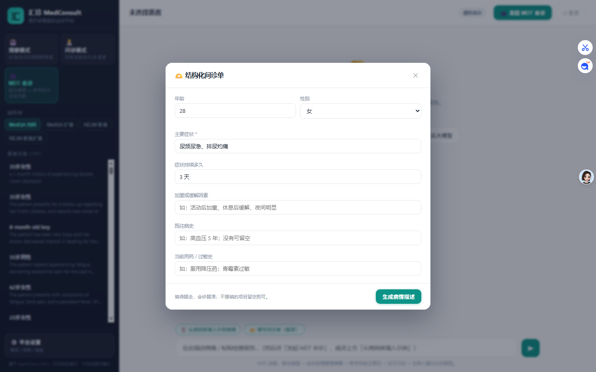
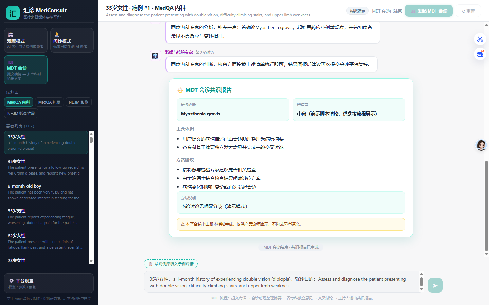
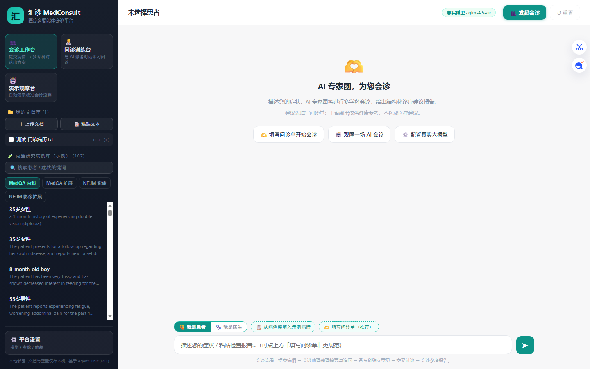

<div align="center">

# 🏥 MedConsult · 汇诊

**A local-first medical multi-agent consultation platform**
Multi-specialist AI teams · Document-grounded RAG · Medical calculators · Session memory · Prompt pool

[English](README.md) | [简体中文](README.zh-CN.md) | [日本語](README.ja.md)

`MIT License` `Python 3.10+` `No web framework` `Data stays on your machine`

**[🚀 Quick Start](#-quick-start)** · **[✨ Features](#-features)** · **[🖥 Workspaces](#-three-workspaces)** · **[🧰 Agent Capabilities](#-agent-capabilities)** · **[📄 Docs](#-documentation)**


*Launch screen — pick a workspace and start.*

</div>

---

## ⚠️ Disclaimer

> MedConsult is a **research and demonstration platform**. It is **NOT a medical device** and its output is **not medical advice**. Always consult qualified physicians. You are responsible for compliance with local healthcare regulations before any real-world use.

## ✨ Features

- 🤖 **True multi-agent architecture** — patient, doctor, measurement, moderator and specialist agents collaborate through structured protocols to reach a referenced conclusion.
- 👥 **MDT consultation workbench** — submit a condition (or a de-identified medical record) and watch specialist agents give independent opinions, cross-discuss, and converge on a structured reference report.
- 📁 **Local document library** — upload real files (`txt / md / pdf / docx`) that stay on your disk; consultations can cite them as evidence.
- 🔎 **RAG retrieval tool** — documents are chunk-indexed on ingest and automatically retrieved by relevance during consultations.
- 🧮 **Medical calculator tools** — MAP, BMI and Cockcroft-Gault creatinine clearance are detected and computed deterministically, with results written into the report.
- 🧠 **Session memory** — every consultation is auto-archived locally and can be replayed, deleted, or cleared.
- 📝 **Prompt pool** — edit every agent's system prompt, save named presets per role, and switch instantly (great for hospital-specific prompt assets).
- 🧰 **Configurable sandbox** — tool whitelist (retrieval / calculator / memory), per-request timeout, and a strict local-data boundary.
- 🔌 **Any OpenAI-compatible LLM** — OpenAI, DeepSeek, GLM, Qwen, Ollama… with per-role model assignment and a one-click connection test.
- 🖥 **Zero web framework** — the whole server is Python standard library; the frontend is dependency-free vanilla JS.

## 🖥 Three Workspaces

| Workspace | Audience | What happens |
|---|---|---|
| 👥 **Consultation Workbench** (default) | Patients & primary-care referral | Describe a condition → intake clarification → multi-specialist discussion → structured reference report |
| 🧑‍⚕️ **Consultation Trainer** | Medical students & training | Interview an AI patient with the `REQUEST TEST` / `DIAGNOSIS READY` protocol; the moderator agent scores the final diagnosis |
| 🤖 **Demo Stage** | Product demos & teaching | One click plays a complete standard consultation end-to-end |

## 🚀 Quick Start

```bash
git clone https://github.com/Morningstar202604/medconsult.git
cd medconsult

python -m venv .venv
# Windows
.venv\Scripts\python -m pip install -r requirements.txt
# Linux / macOS
.venv/bin/python -m pip install -r requirements.txt

.venv/Scripts/python server.py      # Windows
.venv/bin/python server.py          # Linux / macOS
```

Open **http://127.0.0.1:8765** — done. Or double-click `start_web.bat` on Windows.

### Configure an LLM (30 seconds)

Option A — server-wide defaults in `config.json` (see `config.json.example`, gitignored):

```json
{ "api_key": "sk-...", "base_url": "https://api.deepseek.com/v1", "model": "deepseek-chat" }
```

Option B — in-app: **⚙️ Settings → Runtime → Real LLM**, paste your key, hit **🔌 Test Connection**.
Settings are stored in your browser's localStorage; keys never leave your machine.

> Without any key the platform still runs in **scripted demo mode** (no API calls), and the built-in English research case library (MedQA / NEJM, 456 cases) works as training material.

## 🧰 Agent Capabilities

| Capability | Where to configure | Notes |
|---|---|---|
| Multi-role agents | Settings → Agent models | Per-role model, temperature, max tokens |
| Prompt pool | Settings → Role prompts | Editable system prompts + named presets on disk |
| Document retrieval (RAG) | Settings → Tools & Sandbox | Chunk index built on ingest, auto-retrieved per case |
| Medical calculators | Settings → Tools & Sandbox | MAP / BMI / Cockcroft-Gault, deterministic & auditable |
| Session memory | Sidebar → 🕘 Consultation records | Auto-archive, replay, delete, clear |
| Bias injection | Settings → Bias | 13 cognitive biases for research (upstream AgentClinic protocol) |
| Connection test | Settings → Runtime | One-click verify against any OpenAI-compatible endpoint |

Everything runs locally: documents, sessions, prompts and keys never leave the machine — only the LLM provider you configure is called.

## 📸 Screenshots

| | |
|---|---|
|  |  |
| *Structured intake form + pre-consultation clarification* | *Multi-discipline reference report* |
|  |  |
| *Local document library* | *Tools, sandbox and prompt pool settings* |

## 📂 Repository Layout

```
├─ server.py               # stdlib HTTP server (port 8765)
├─ app/
│  ├─ engine.py            # consultation engine (auto / human modes)
│  ├─ mdt.py               # MDT pipeline: summarize → retrieve → discuss → report
│  ├─ rag.py               # chunk index + keyword retrieval (RAG tool)
│  ├─ tools.py             # medical calculator tools
│  ├─ library.py           # local document library (pdf/docx/txt…)
│  ├─ sessions.py          # consultation memory
│  ├─ prompts.py           # prompt pool storage
│  ├─ llm.py               # OpenAI-compatible streaming bridge (0.28 SDK)
│  ├─ cases.py             # built-in research case loaders
│  └─ mockllm.py           # scripted agents for keyless demo mode
├─ web/                    # dependency-free frontend (vanilla JS)
├─ agentclinic.py          # upstream AgentClinic benchmark CLI (kept for research)
├─ generate_cases/         # case generation tutorials (upstream)
├─ tests/e2e_cdp.py        # headless-browser end-to-end test (CDP)
└─ docs/                   # architecture notes & screenshots
```

## 📄 Documentation

- [Architecture notes](docs/ARCHITECTURE.md)
- [Configuration reference](config.json.example)
- [Changelog](CHANGELOG.md)
- [Upstream baseline](NOTICE)

## 🗺 Roadmap

- [ ] Streaming (typewriter) output
- [ ] Multi-session tabs with live follow-up questions
- [ ] Dark theme
- [ ] FHIR/HIS connectors for hospital deployments

## ⭐ Support the project

If MedConsult helps you — a medical student, a builder, or a hospital team —
please **give it a star ⭐**. Stars are how open-source medical tooling gets discovered.

## 📜 License & Acknowledgments

[MIT](LICENSE) © 2026 MedConsult Contributors · Built on [AgentClinic](https://github.com/samuelschmidgall/AgentClinic) (MIT) by Samuel Schmidgall — see [NOTICE](NOTICE).

Built-in research cases come from the MedQA / NEJM-derived datasets shipped with AgentClinic and remain for research use.

## 📚 Citation

```bibtex
@misc{medconsult2026,
  title  = {MedConsult: A Local-First Medical Multi-Agent Consultation Platform},
  author = {MedConsult Contributors},
  year   = {2026},
  url    = {https://github.com/Morningstar202604/medconsult}
}
```

<div align="center"><sub>Made for people who believe AI should help clinicians, not replace them.</sub></div>
