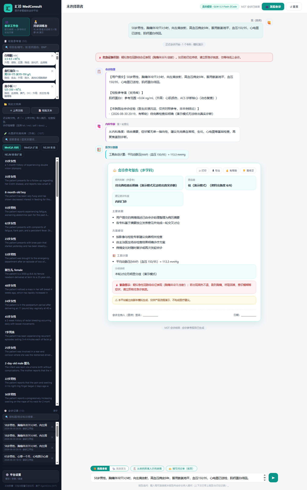
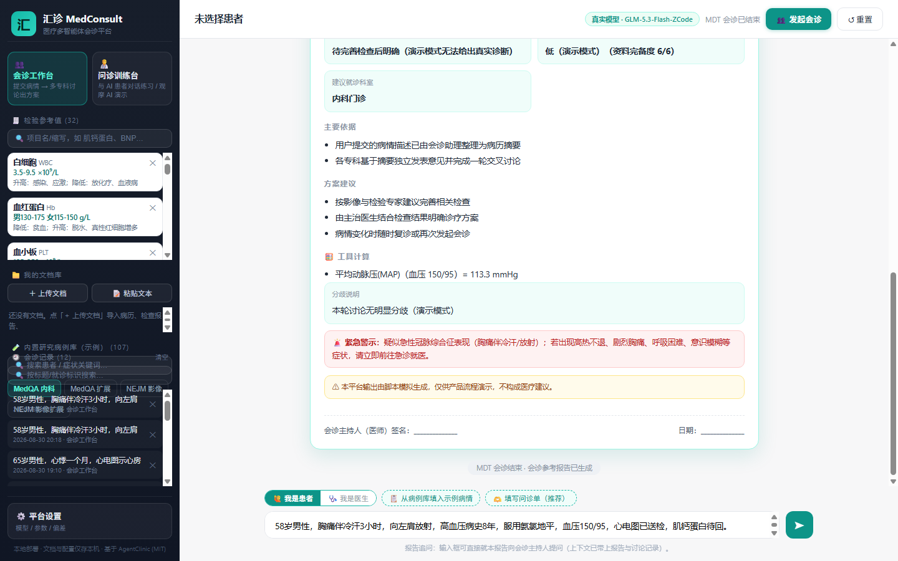
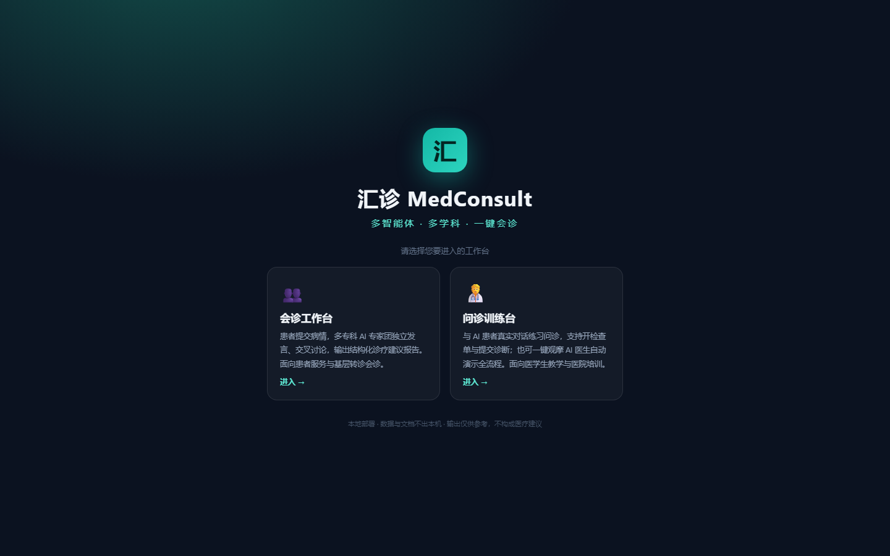
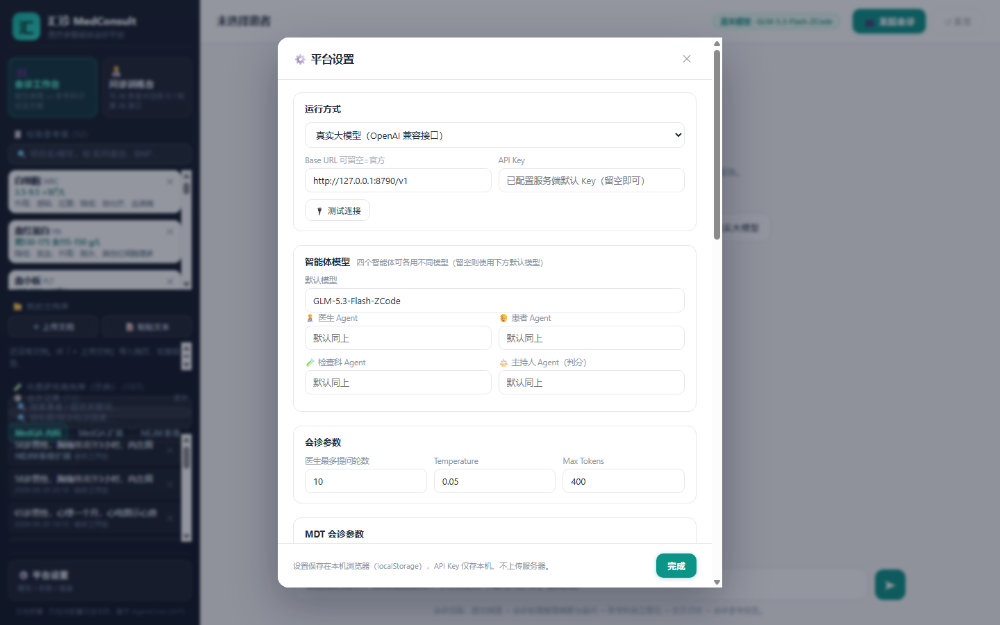

<div align="center">

# 🏥 MedConsult · 汇诊

**本地优先、面向医院的多智能体 MDT 会诊平台**

多专科 AI 专家团 · 临床评分工具 · 检验参考值支持库 · 提示词分层与技能包 · 院内经验闭环 · 报告打印归档

[English](README.md) | [简体中文](README.zh-CN.md) | [日本語](README.ja.md)

`MIT 协议` `Python 3.10+` `零 Web 框架` `数据不出本机`

**MDT 多学科会诊** · **临床决策支持** · **多智能体** · **RAG 知识库** · **HIS/EMR 友好** · **DeepSeek / GLM / Qwen / OpenAI / Ollama**

</div>

---

## ⚠️ 免责声明

> 汇诊是**科研与演示平台**，不是医疗器械。所有输出仅供执业医师参考，不构成医疗建议或处方。实际使用请遵守当地医疗法规。

## ✨ 核心特性

**🏥 面向真实医院流程**

- 🚨 **危急征象先于一切**——确定性红旗扫描（ACS/卒中/夹层/出血/脓毒症/急腹症等），在专家发言**之前**横幅警示，并写入报告紧急警示区。
- 📊 **资料完备度评分**——6 要素结构化核查（年龄性别/病程/既往史/用药过敏/辅助检查/生命体征），缺项明示；与置信度并列展示，**可解释而非凭感觉**。
- 🧮 **确定性医学计算与评分**——MAP、BMI、Cockcroft-Gault 肌酐清除率、**CHA₂DS₂-VASc**、**Wells（DVT/PE）**、**CURB-65**：从病情文本自动识别、本地计算、全程留痕可审计。
- 🧾 **检验参考值支持库**——内置 32+ 常见检验项目（参考范围/单位/临床意义），侧栏随时检索，医院可增删改；**会诊自动注入**病情涉及项目的参考范围。
- 🖨 **报告打印与归档**——可配医院抬头、生成时间、**医师签名/日期栏**，一键导出独立 HTML 存入病案。
- 🔄 **报告追问**——报告生成后输入框保持可用，医生就报告向主持人 Agent 提问（自动携带报告与讨论上下文）。翻病历核对报告时最自然的交互。
- 🧑‍🏫 **问诊训练台**——与 AI 患者对话练习问诊（REQUEST TEST / DIAGNOSIS READY 协议），主持人自动判分；一键 **AI 演示**用于教学与展示。

**🧠 真正的 Agent 工程**

- 🥞 **提示词分层**——`AI 安全基线 → 医院规范（config 可配）→ 会诊技能 → 角色任务`，注入每个会诊智能体。医院的用药目录、检查路径规范，写进配置即可全局生效。
- 🧩 **技能包（Skills）**——可复用的专科会诊指令集（内置：抗凝管理/胸痛鉴别/儿童用药/感染会诊），按病种勾选，设置界面即可管理，医院可持续沉淀科室技能库。
- 📚 **上下文工程**——病历摘要 + RAG 文档片段 + 检验参考值 + 既往相似经验，按预算组装给每个智能体；二轮讨论专家必带病历（这是我们修掉的真实缺陷）。
- 🌱 **长期学习闭环**——医生对报告 👍有帮助 / 👎需修正（可填修正意见），沉淀入本院经验库；相似病情的后续会诊自动注入既往经验供对照。
- 🤖 **真多智能体 MDT**——预问诊追问 → 各专科独立意见（并发）→ 交叉讨论 → 主持人共识报告；每个角色可配不同模型。

**🔒 本地优先与安全**

- 文档、会诊记录、提示词、反馈、配置全部只存本机，仅调用你配置的模型服务。
- 服务端零框架（Python 标准库），前端零依赖原生 JS；`pip install -r requirements.txt` 即用。
- 上传白名单、路径穿越加固、请求体上限、端口双绑定防护。

## 🖼 界面速览


*会诊工作台全流程*

| | |
|---|---|
|  |  |
| *报告卡：置信度+资料完备度、工具计算、紧急警示、打印/导出、反馈按钮* | *启动页：会诊工作台 / 问诊训练台* |
|  |
| *⚙️ 设置：分角色模型、提示词池、技能包、医院规范、偏差注入、沙箱* |

## 🚀 快速开始

```bash
git clone https://github.com/Morningstar202604/medconsult.git
cd medconsult

python -m venv .venv
# Windows
.venv\Scripts\python -m pip install -r requirements.txt
.venv\Scripts\python server.py
# Linux / macOS
python3 -m venv .venv && .venv/bin/python -m pip install -r requirements.txt
.venv/bin/python server.py
```

打开 **http://127.0.0.1:8765** —— Windows 也可直接双击 `start_web.bat`。
不配 API Key 时平台以**脚本演示模式**运行；内置英文研究病例库（MedQA / NEJM，456 例）可作为训练素材。

### 30 秒接入大模型

方式一：服务端默认配置 `config.json`（见 `config.json.example`，已被 gitignore）：

```json
{
  "api_key": "sk-...",
  "base_url": "https://api.deepseek.com/v1",
  "model": "deepseek-chat",
  "hospital_name": "XX医院",
  "hospital_policy": "本院规范：抗凝药物仅限目录内品种；出院带药不超过14天。"
}
```

兼容 **OpenAI / DeepSeek / GLM（open.bigmodel.cn/api/paas/v4）/ Qwen / Ollama** 等任何 OpenAI 兼容端点（含本地模型）。
方式二：页面内 **⚙️ 设置 → 真实大模型**，粘贴 Key，点「🔌 测试连接」。Key 只存本机浏览器。

## 🧠 Agent 架构

```
┌────────────────────────────────────────────────────────┐
│ 提示词分层（每个会诊智能体）                             │
│  1. AI 安全基线   — 不得虚构检查/病史，医师在环          │
│  2. 医院规范      — 本院用药目录 / 检查路径（可配）      │
│  3. 会诊技能      — 抗凝 / 胸痛 / 儿童用药 / 感染（可管）│
│  4. 角色任务      — 专科专家 / 主持人                    │
├────────────────────────────────────────────────────────┤
│ 上下文组装：病历摘要 · RAG 片段 · 检验参考值 ·          │
│             既往相似经验 · 计算器结果                    │
├────────────────────────────────────────────────────────┤
│ 流水线：危急分诊 → 摘要 → 专科独立意见（并发）→         │
│         交叉讨论 → 共识报告 → 医生追问 → 反馈沉淀       │
└────────────────────────────────────────────────────────┘
```

## ⚙️ 配置项

| 键 | 用途 |
|---|---|
| `api_key` / `base_url` / `model` | 大模型端点（OpenAI 兼容，含 Ollama） |
| `hospital_name` | 打印报告抬头 |
| `hospital_policy` | 注入每个智能体的本院规范 |
| `report_footer` | 打印报告页脚备注 |

环境变量覆盖：`MEDCONSULT_API_KEY` / `MEDCONSULT_BASE_URL` / `MEDCONSULT_MODEL` / `MEDCONSULT_HOST` / `MEDCONSULT_PORT`。

## 📚 文档

- [English README](README.md) · [更新日志](CHANGELOG.md) · [参与贡献](CONTRIBUTING.md) · [安全策略](SECURITY.md)
- 上游研究基线：[AgentClinic](https://github.com/SamuelSchmidgall/AgentClinic)（MIT）——训练台与判分协议沿用其基准。

## 许可

MIT © MedConsult Contributors。请阅读上方医疗免责声明。
